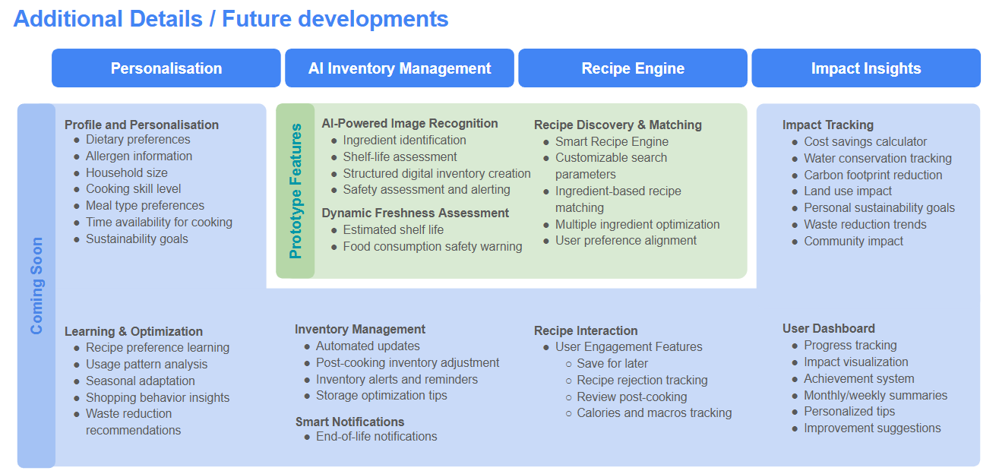

# Savour - Features and Roadmap

This document provides a concise overview of the prototype features and planned roadmap for **Savour**.

📄 [View the full features and roadmap here](../images/features_and_roadmap/features_and_roadmap.png)

## **Prototype Features**

### **AI Inventory Management**
1. **AI-Powered Image Recognition**
   - Ingredient identification
   - Shelf-life assessment
   - Structured digital inventory creation
   - Safety assessment and alerting

2. **Dynamic Freshness Assessment**
   - Estimated shelf life
   - Food consumption safety warning

### **Recipe Engine**
3. **Recipe Discovery & Matching**
   - Smart Recipe Engine
   - Customizable search parameters
   - Ingredient-based recipe matching
   - Multiple ingredient optimization
   - User preference alignment

---

## **Roadmap Features**

### **Personalisation**
1. **Profile and Personalisation**
   - Dietary preferences
   - Allergen information
   - Household size
   - Cooking skill level
   - Meal type preferences
   - Time availability for cooking
   - Sustainability goals

2. **Learning & Optimization**
   - Recipe preference learning
   - Usage pattern analysis
   - Seasonal adaptation
   - Shopping behavior insights
   - Waste reduction recommendations

### **AI Inventory Management**
3. **Inventory Management**
   - Automated updates
   - Post-cooking inventory adjustment
   - Inventory alerts and reminders
   - Storage optimization tips

4. **Smart Notifications**
   - End-of-life notifications

### **Recipe Engine**
5. **Recipe Interaction**
   - User Engagement Features:
     - Save for later
     - Recipe rejection tracking
     - Review post-cooking
     - Calories and macros tracking

### **Impact Insights**
6. **Impact Tracking**
   - Cost savings calculator
   - Water conservation tracking
   - Carbon footprint reduction
   - Land use impact
   - Personal sustainability goals
   - Waste reduction trends
   - Community impact

7. **User Dashboard**
   - Progress tracking
   - Impact visualization
   - Achievement system
   - Monthly/weekly summaries
   - Personalized tips
   - Improvement suggestions
